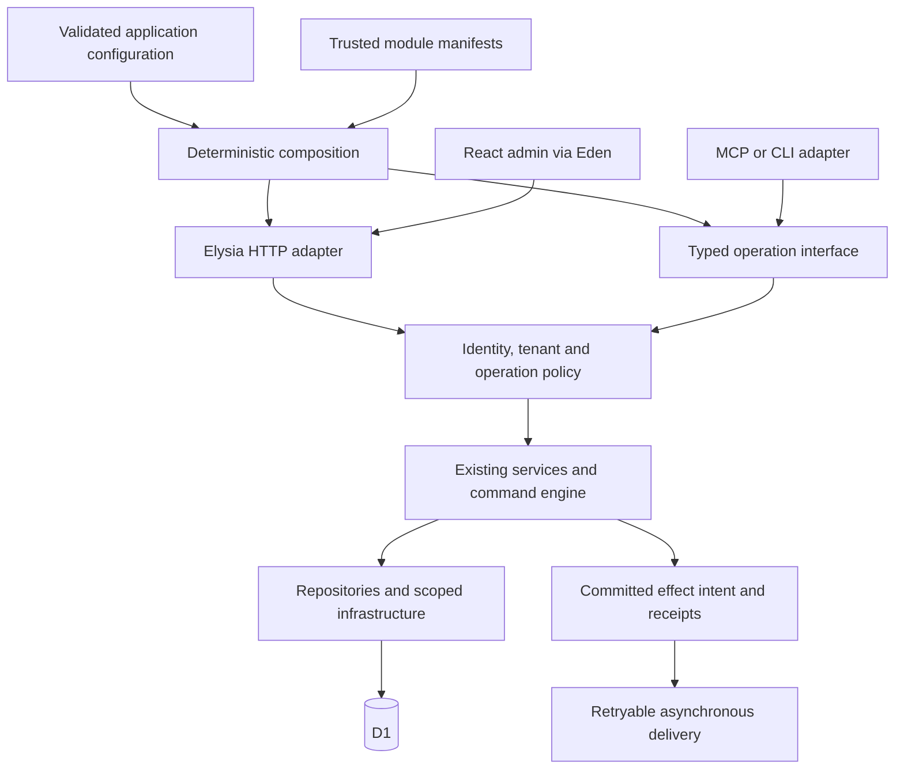

# ADR: Modular, composable EdgeCMS with qualified deployment profiles

Date: 2026-09-11

Status: **Proposed**. This document proposes architecture and acceptance gates; it does not assert implementation, package publication or deployment completion.

Context: [benchmark and evidence ledger](../comparisons/2026-09-11-headless-cms-benchmark.md). Delivery: [implementation plan](../plans/2026-09-11-headless-cms-gap-implementation-plan.md). Existing [architecture decisions](../architecture-decisions.md) remain in force.

## Problem and intended outcome

An adopter should create a real application, configure content and trusted extensions, run it locally, publish through the admin or an authorized agent, and deploy an auditable version. An extension author should compose supported behavior without editing application internals. A maintainer should test two independent applications and measure valid requests under load.

EdgeCMS has real feature services, a `createApp()` factory, typed contracts, commands, snapshots and an admin. The remaining gaps are their integration and support boundaries: starter stubs, module-scoped runtime state, duplicated plugin contracts, incomplete performance evidence and a generic AI preview/execution mismatch [benchmark E1–E10].

## Proposed decision

### 1. Keep a modular application and the Cloudflare default

Retain Elysia, Eden, React, Bun, Drizzle, D1, KV, R2, Queues and scheduling. Keep controller → service → repository ownership. Use one deployable API/admin application by default. Modules are code boundaries, not an automatic service-per-feature deployment strategy.

The minimum kernel owns trusted request identity, tenant admission, authorization, validation, command dispatch and durable mutation evidence. Collections, entries and public delivery compose around it. Media, webhooks, scheduling and AI remain feature modules with declared dependencies. Optional features can be excluded only when dependent routes, bindings and admin affordances are consistently removed; security and publication rules are never optional middleware.

Start inside the existing application. Extract a consumer runtime package only when T02 has a real external consumer and T03 establishes its boundary. Do not create a package for every feature or a universal provider framework in advance.

### 2. Separate immutable composition from request execution

Extend the existing zero-argument `createApp()` through a backward-compatible composition layer. The application supplies validated configuration, enabled modules and infrastructure factories. Worker bootstrap supplies its bindings; requests supply authenticated actor, resolved tenant, request ID, cancellation/deadline and the scoped services they need.

Configuration parsing and route compilation can happen once. Database use and binding I/O must obey Worker lifecycle constraints. Tests can import contracts/domain operations without initializing Cloudflare environment, warming caches or mutating shared plugin state. Each application instance owns its registry and metric/effect sinks; requests do not mutate a global current tenant or actor.

This is a target logical graph. It does not introduce a new public endpoint or imply that an MCP adapter exists. Local calls must enforce the same operation authorization as HTTP. The caller cannot gain privilege by setting an actor source string.

### 3. Define a small trusted extension contract

Unify the SDK and internal catalog shapes through a versioned contract. A manifest declares its identifier/version, compatible core range, dependencies, required bindings, operation/route namespaces, fields, admin contributions and hooks. Validate and order the dependency graph at composition time; reject duplicate ownership, missing dependencies, cycles and unsupported contracts before serving requests.

Use build-time trusted plugins and explicit service injection. Preserve the current restricted admin plugin namespace initially. Permission declarations are documentation unless checked against the authenticated principal on every operation. Do not describe a timeout or route-prefix check as a sandbox for malicious code; in-process trusted plugins retain the host's trust boundary. Public plugin routes require a separate authorization/cache contract and review.

Distinguish validation hooks that can reject a mutation from post-commit integration effects. A timer cannot preempt synchronous JavaScript or undo an already completed side effect. The host owns retry, timeout, error reporting and effect identity. Avoid executable configuration from tenant content and arbitrary dynamic imports.

### 4. Preserve typed boundaries and choose one schema owner

Keep ArkType domain schemas and TypeBox transport validators as currently decided. Generate or test their overlap where feasible; do not replace intentional framework-specific validators merely to remove repetition. Keep Eden's current route contract and add runtime response validation at external/untrusted boundaries, rather than casting arbitrary JSON to a type.

A public operation interface must return typed results and stable error codes. Public delivery projection excludes private/admin fields; cursors, relation depth and batch sizes are bounded. Contract tests cover a packaged consumer, not just monorepo path aliases.

For content definitions, keep the current runtime builder as the default authority. Add optional managed-schema mode for projects that need definitions in Git. Reuse collection export, then add canonical serialization, revision/hash, previewable diff and compatibility checks. A managed collection rejects ad hoc schema edits until ownership is deliberately transferred. Moving content data is separate from promoting definitions; neither implicitly runs destructive physical migrations.

Custom fields compose validation, editor rendering, default values, serialization, localization, relation/media behavior and export metadata through a shared descriptor. Existing field types remain compatible. Schema changes invalidate or migrate the corresponding descriptors explicitly.

### 5. Make agent writes execute the reviewed intent

Use the command engine as the mutation authority. Generalize the import workflow's stored-command/hash pattern rather than adding a parallel agent executor.

The target flow is discovery → plan/preview → policy authorization → execute stored intent → inspect receipt. A preview receipt binds tenant, principal, normalized command payload, relevant content versions, schema/policy revision and expiry. Execution verifies the receipt, permissions and current versions and uses the stored validated payload; it does not ask the model to regenerate it. Destructive or publishing actions require the configured confirmation policy to be satisfied. Content and imported documents are data, never permission to execute tools.

Add durable idempotency scoped to tenant, principal and operation intent. Reusing a key with a different payload is a conflict; retrying the same committed intent returns the original result. Use atomic storage constraints or conditional writes supported by the actual D1 adapter, not a process-local map. Distinguish atomic single-operation work from multi-command partial completion and report resumable item-level results.

Preview may record audit evidence, as the current engine does. It must not modify content or trigger external mutation effects. Persist critical mutation/audit/effect intent at a defined commit boundary; asynchronous delivery can then be retried. Do not equate queue delivery with exactly-once execution.

MCP and CLI are thin adapters over this interface. Start with permission-filtered discovery and reads, then preview, and enable writes only after T05's negative tests pass. Report structured conflicts, retryability, correlation IDs, effective scope and job status. Raw database access and unrestricted arbitrary command tools are outside this decision.

### 6. Optimize through a trustworthy measurement boundary

Adopt the benchmark protocol before claiming speed or throughput. Preserve in-process, local Worker, deployed backend and CDN lanes. Validate actual content, not HTTP success alone. The current 50/100 ms p95 values remain scoped targets; the 1 ms in-process budget is not Worker CPU or a universal latency promise.

Count D1/KV/R2 calls before changing framework code. Reduce repeated lookups, bound relation expansion and list size, and move eligible fanout off response paths. Keep security-relevant cache key dimensions and generation-aware invalidation. A late cache fill must not resurrect unpublished content. Define whether ordinary delivery permits bounded staleness; a strict withdrawal path needs authoritative visibility enforcement and cannot rely solely on eventually consistent invalidation.

Qualify D1 Sessions for eligible reads with explicit bookmark and freshness rules before enabling replica use. Authorization and immediately relevant publication decisions must meet their required freshness. Treat primary writes, large scans and hot tenants as measured capacity boundaries. Dedicated resources or tenant partitioning need actual saturation evidence and an operational ownership model; they are not the first optimization.

### 7. Productize deployment and recovery

| Profile | Decision | Qualification |
| --- | --- | --- |
| Unified API Worker and static admin in a customer Cloudflare account | First consumer target; current repository topology is the starting point. | Packed starter → local Worker/admin → first publish → clean deploy → restart/persistence verification. |
| Separate static admin hosting | Optional profile. | Correct API base, cookies, trusted origins, CSRF, tenant routing and matching client/API contracts. |
| Separate public delivery Worker | Deferred until measurements justify it. | Smaller bundle or isolation benefit, equivalent auth/cache semantics and no extra mutation authority. |
| Dedicated tenant deployment/resources | Available as a future deployment pattern, not a current automated provisioning claim. | Isolation, secrets, quotas, provisioning retries, upgrades and recovery tested for the same artifact. |
| Generic Docker/on-premises runtime | Feasibility gate only. | Independent database/storage/cache/queue/scheduler adapters and the same behavior suite; no dependency on development emulation for production support. |

The application lifecycle is create → configure → local development → build/test → plan migration → deploy → verify → upgrade/recover. Borrow this clarity from Strapi, not its server implementation. Version package, application contract, module graph, admin assets, migrations and environment configuration in the release manifest.

Promote verified artifacts with checksums. Where environment-specific builds are necessary, record the reason and verify each artifact instead of claiming byte-identical promotion. Migrations use explicit expand/contract sequencing and compatibility with both the departing and arriving application versions. Worker rollback does not roll back D1 or R2. Back up and exercise restore for data, media references and required configuration before destructive changes. Required binding failure blocks readiness; optional degraded services must be named and reflected in usable UI states.

### 8. Evaluate complete admin and operator journeys

Preserve the existing editor, collection export, locale, history, rollback and offline primitives. Build coherent field-extension and operation interfaces around them. Measure first successful publish, editing an existing entry, translation, media selection, rollback and offline conflict resolution. Use progressive disclosure for advanced settings, clearly distinguish saved/draft/published/queued states, and verify keyboard focus, narrow screens and recoverable errors.

Additional improvements should follow evidence: import/export round trips, restore drills, tenant usage budgets, webhook replay, retention and upgrade compatibility have observable operator value. New dashboards or AI actions are not substitutes for these outcomes.

## Alternatives and tradeoffs

| Alternative | Disposition | Reason |
| --- | --- | --- |
| Keep adding standalone helpers to the current app | Insufficient by itself. | Does not deliver a running consumer app or isolate global runtime state. |
| Replace Elysia with Hono/native fetch immediately | Not selected. | No trustworthy comparative runtime measurement justifies migration and contract churn. Revisit only with a scoped measured win. |
| Move to Node/Postgres to resemble Strapi | Not selected. | Changes the product's infrastructure and operational model before portability demand is established. |
| Split every feature into its own Worker/service/package | Not selected. | Adds deployment and consistency costs before traffic or team ownership requires them. |
| Adopt arbitrary runtime plugin installation | Not selected. | Needs a real isolation and supply-chain model beyond the present trusted catalog. |
| Implement a universal infrastructure interface now | Deferred. | First define seams at actual Worker/test boundaries, then qualify a second provider with concrete behavior. |

This proposal adds manifest/versioning discipline and some explicit dependency plumbing. Those costs are acceptable only when they reduce consumer setup, isolated-test effort or extension coupling. Package proliferation and configuration options without an exercised consumer are rejection criteria.

## Acceptance, consequences and reconsideration

Accept implementation slice by slice. Required proof includes an actual consumer publish journey, independent app instances, plugin compatibility failures, preserved API contracts, preview/execute equality, durable duplicate suppression, cache visibility under races, and deployment/restore receipts. The plan defines the exact gates. No unresolved High finding may be represented as product release readiness.

Reconsider a separate public Worker after measured bundle/startup or traffic contention evidence; reconsider generic containers after a real hosting requirement and successful adapter spike; reconsider data partitioning after database saturation/fairness measurements. Retain compatibility entry points during migration. Roll back reversible code by restoring the prior composition and disabling new opt-in profiles; persistently changed data requires its own migration/recovery procedure.

This ADR can be accepted as a direction without implying every planned capability is implemented. The current submission leaves its status Proposed and preserves all earlier accepted behavior conventions.
